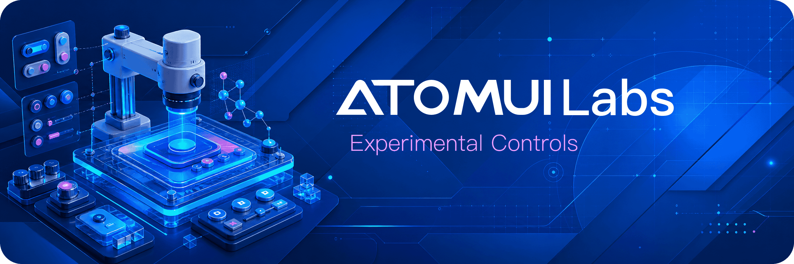

<p align="center">
  
</p>

# AtomUI Labs

[English](README.md)

AtomUI Labs 是 AtomUI 生态的实验性桌面控件工作区。新的桌面控件可以先在这里完成设计、验证、打包和测试，之后再晋升为稳定的 AtomUI 包。

## 项目定位

AtomUI Labs 让实验控件与稳定 AtomUI API 保持隔离，同时继续遵循一致的工程约束：

- 每个实验控件拥有独立项目和独立 NuGet 包；
- 行为变更应配套对应的测试项目；
- Labs 包版本与仓库使用的 AtomUI 版本保持一致；
- 构建、打包、发布和输出目录规则由仓库根目录集中管理。

## 安装

AtomUI Labs 不发布单一聚合包。使用时请安装目标控件对应的 Labs 包。

Labs 包名遵循以下格式：

```bash
dotnet add package AtomUI.Labs.Controls.<ControlName>
```

当前已实现的 LED 控件家族采用明确的命名例外：

```bash
dotnet add package AtomUI.Labs.Led
```

Labs 包版本应与应用使用的 AtomUI 主包版本保持一致。

## 常用命令

```bash
dotnet restore AtomUI.Labs.slnx
dotnet build AtomUI.Labs.slnx --configuration Debug
pwsh ./scripts/PackToLocal.ps1 -BuildType Release
pwsh ./scripts/PublishToLocalSources.ps1 -LocalSourcesDir /path/to/local-feed -BuildType Release
git diff --check
```

包产物输出到 `output/Nuget/<Configuration>`。

## 文档

- [工程规范总览](docs/engineering/overview.md)
- [构建、打包与发布](docs/architecture/build-and-packaging.md)
- [实验控件文档](docs/controls/overview.md)
- [LED 控件家族](docs/controls/led/overview.md)
- [全局工程规范](docs/global-engineering-guidelines.md)

## 状态说明

Labs 包处于实验阶段。控件晋升为稳定 AtomUI 包之前，公开 API 可能发生变化。
